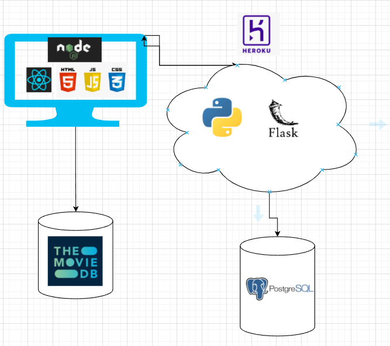

# RecommendAMov.ie
### GMIT BSc (Hons) Computing in Software Development
### Applied Project and Minor Dissertation

This project was built with the aim of recommending movies to a user by finding movies similar to movies that they've already seen and liked. 
It is a single page web application that allows users to register and login. It allows the user to browse a vast amount of movies and also to "like" these movies. 
The web application then compares user's likes to a database of movies that are stored in PostgreSQL. It does this using cosine similarity. The web app returns the most relevant movies back to the user. 

## Main Features:
- A user can register/log in.
- Users are able see a vast selection of movies.
- Users can filter movies by genre.
- Users can search for any particular movie.
- Users can "like" movies.
- Users' likes are stored in the back-end using PostGreSQL.
- Recommendations are returned to the users by use of Cosine Similarity.
- Users can remove recommendations from the returned list by using the dislike feature.

## Demonstration of Project:
The link below will bring you to a demonstration of the project in action.
https://youtu.be/wLS8fvFaEI0

## Architecture

## Technologies stack
- JavaScript
- React
- Flask
- Python
- PostgreSQL 

## TMDB
All posters in this application belong to The Movie DataBase(TMDB). All movie information is also provided by TMDB. TMDB is a community built movie and TV database that is maintained by its users. It can be found here https://www.themoviedb.org/. While this application uses the TMDB API, it is not endorsed or certified by TMDB.

# Resources 
[Content Based Recommendation Systems](https://medium.com/web-mining-is688-spring-2021/content-based-movie-recommendation-system-72f122641eab#:~:text=Content%20Based%20Recommendation%20System%3A%20It,a%20show%20similar%20to%20it.)

[The Show- Youtube Channel](https://www.youtube.com/channel/UCIvL4BDxk3MrKjTF1avFmQQ)

[JWT with Flask](https://realpython.com/token-based-authentication-with-flask/)

[Consuming RESTful APIs](https://www.restapiexample.com/python/consuming-a-restful-api-with-python-and-flask/)

[Material UI Modal](https://mui.com/material-ui/react-modal/)

